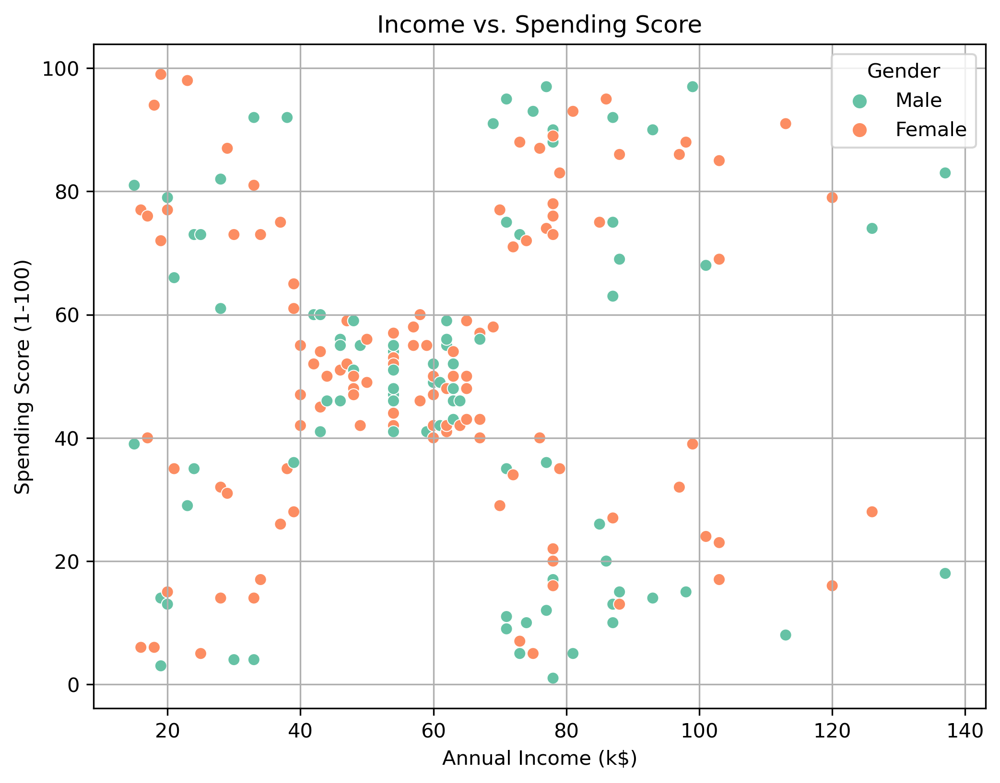
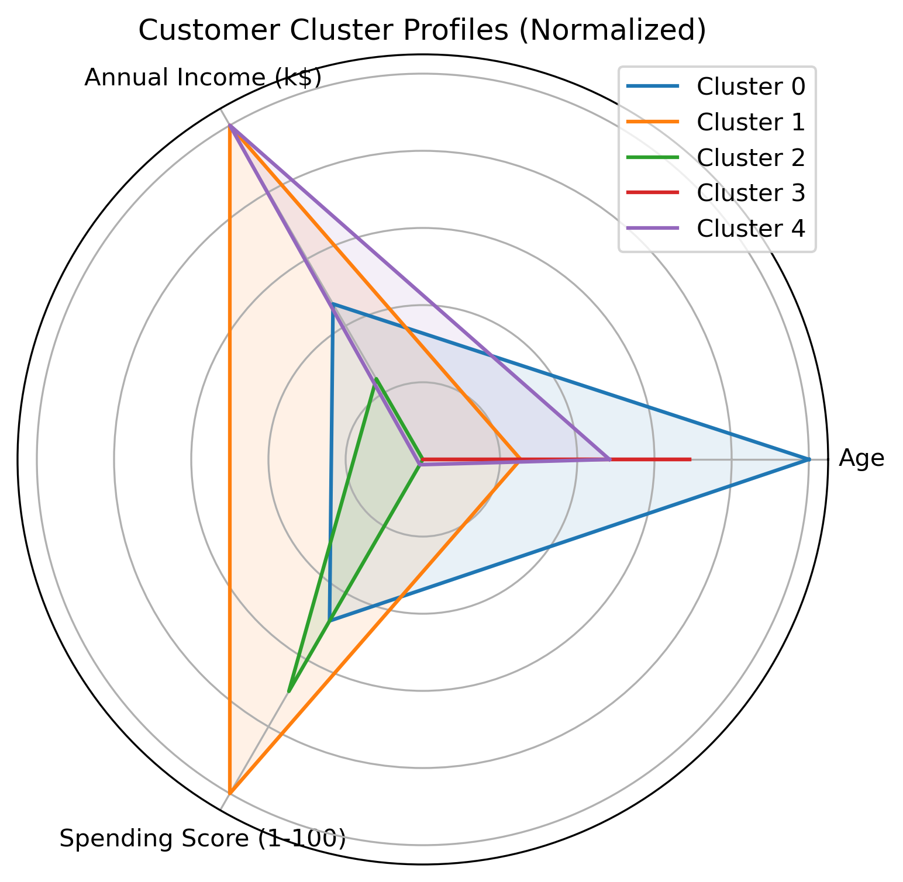

# 🛍️ Mall Customer Segmentation (KMeans Clustering)

This project uses KMeans clustering to segment customers based on their age, annual income, and spending score. It helps mall management understand customer behavior and optimize marketing strategies.

## 📁 Dataset
- **Source**: [Mall_Customers.csv](Mall_Customers.csv)
- **Columns**:
  - Gender
  - Age
  - Annual Income (k$)
  - Spending Score (1–100)

## 🔍 Project Workflow

1. **Data Cleaning**
2. **Exploratory Data Analysis (EDA)**
3. **KMeans Clustering**
4. **Cluster Profiling**
5. **Business Recommendations**

## 📊 Highlights

- 🎯 Identified 5 customer segments using KMeans.
- 📈 Used Elbow Method to find optimal clusters.
- 📊 Cluster visualizations (scatter plots, radar charts).
- 🧠 Business insights for targeted marketing.

## 📦 Libraries Used

- `pandas`
- `seaborn`
- `matplotlib`
- `sklearn`

## 📸 Sample Visualizations

*(You can save some plots as `.png` and upload them to an `/images/` folder)*

## 💡 Author

Mohamed Khaled – Data Analyst & Business Engineer  
Feel free to connect on [LinkedIn](#) or check out more of my work!

---

## 🚀 How to Run

1. Clone the repo
2. Open `Mall_Customer_Segmentation.ipynb` in Jupyter
3. Run all cells

